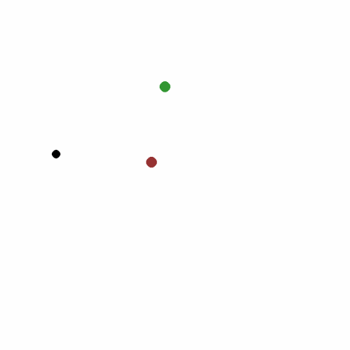
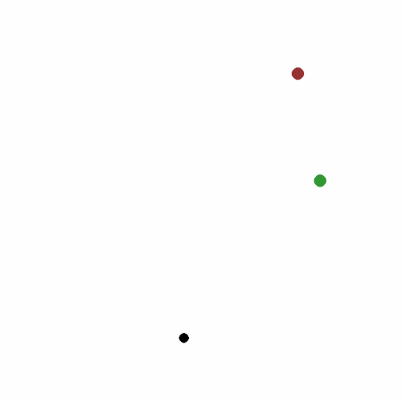
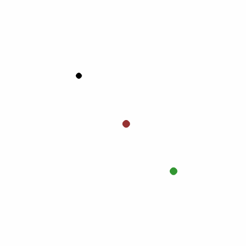
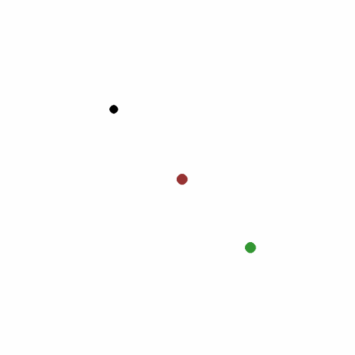

# Safe Learning Environments

This repository consists of a package for simple Safe Learning tasks, compatible with Python [Gymnasium library](https://pypi.org/project/gymnasium/).

<p align="center">




</p>

## Features and Environments

The package publishes the following environments:
 * `safe_learning_environments/TargetHazardWorld-v0`: this environment consists of a simple task; a single agent (black) must be able to read a target (green) while avoiding a hazard (red). The Observation Space consists of 6 vectors, representing the position (-1 to 1) and velocity (-1 to 1) of the objects. The Action Space consists of the accelerations (-1 to 1) for each object.
 
## Gymnasium Compatibility

After instalation, one should be able to import and run an example by following:

```python
import gymnasium
import safe_mpc_environments
```
and then folowing the usual for classical Gymnasium environments:

```python
env = gymnasium.make('safe_mpc_environments/TargetHazardWorld-v0', render_mode = "human")

observation, info = env.reset()

# evolve system
for i in range(1000):
    # sample random action
    action = env.action_space.sample()
    # step the environment
    observation, reward, terminated, truncated, info = env.step(action)

    # completion or error
    if terminated or truncated:
        observation, info = env.reset()

# closes environment
env.close()
```

Other parameters can be specified when making the environment by calling `gymnasium.make()`, such as:
* `render_mode`: similar to classical environments `None`, `"rgb_array"` or `"human"`;
* `window_size`: defines the size, in pixels, that the simulation window will have;
* `location_precision`: defines the distance from agent to target for the task completion;
* `max_absolute_location`: limits the maximum absolute physical position of the objects per coordinate;
* `max_absolute_velocity`: limits the maximum absolute physical velocity of the objects per coordinate;
* `max_absolute_acceleration`: limits the maximum absolute physical acceleration of the objects per coordinate;
* `show_observation_traces`: when `True` set the object traces to be visible during simulations;

Similarly, one can specify initial states (positions of the objects) when calling `reset()` by passing an `options` dictionary containing the keys `"agent_location"`, `"target_location"` or `"hazard_location"`.

## Instalation/Development

It's possible to install the package in developer mode by running
```bash
$ pip install -e /path/to/safe_learning_environments/
```
One is adivised to create a virtual environment for running and reproducing the results. See [Python venv](https://docs.python.org/3/library/venv.html) for details.
